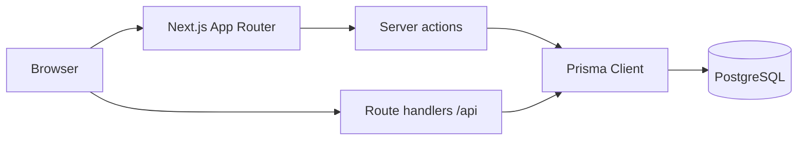

# Agent Skills Manager

**Create, manage, and share AI agent skills** — markdown-style definitions, relational storage, authenticated authors, and a public discovery gallery.

  
  
  
  
  
  
  
  
  
  

Versions follow <code>package.json</code> (e.g. Next.js 16, React 19, TypeScript 5, Tailwind 4). Optional containerized PostgreSQL is described in <code>docker-compose.yml</code>.

---

## Table of contents

1. [Overview](#overview)
2. [Functionality](#functionality)
3. [Architecture](#architecture)
4. [Tech stack](#tech-stack)
5. [Application surface](#application-surface)
6. [Data model](#data-model)
7. [Scripts](#scripts)

---

## Overview

**Agent Skills Manager** is a full-stack application for authoring **skills**: structured content (title, summary, body, visibility) stored in **PostgreSQL** and surfaced through a **Next.js** UI. Registered users maintain a **dashboard** of their skills; **public** skills appear in a shared **gallery** with attribution.

| Layer | Implementation |
|-------|----------------|
| **Presentation** | Next.js App Router, React, Tailwind CSS, DaisyUI; responsive layout and theme-aware UI. |
| **Authentication** | Email/password sign-up and sign-in; passwords hashed with **bcryptjs**; session-based access for protected areas. |
| **Persistence** | Prisma ORM, PostgreSQL, migrations under `prisma/migrations/`. |
| **Integration** | JSON **route handlers** under `app/api/` for auth and skill reads; server actions and server components for app flows. |

---

## Functionality

### Public experience

| Feature | Route | Behavior |
|---------|-------|----------|
| Landing | `/` | Entry point and navigation into the product. |
| About | `/about` | Product and stack orientation. |
| Public gallery | `/skills` | Lists **public** skills with author information; public pages use incremental regeneration on a schedule. |
| Skill detail | `/skills/[id]` | Read-only view of a **public** skill; SEO-oriented metadata. |
| Errors | — | Centralized **404** and root **error** boundaries where configured. |

### Account

| Feature | Route | Behavior |
|---------|-------|----------|
| Registration | `/register` | Create an account with validated forms. |
| Sign-in | `/login` | Establish a session; authenticated users are sent to the dashboard. |

### Authenticated workspace

| Feature | Route | Behavior |
|---------|-------|----------|
| Dashboard | `/dashboard` | Overview of **your** skills with actions to edit or remove. |
| Create skill | `/dashboard/skills/new` | Define name, description, body, and public/private visibility. |
| Edit skill | `/dashboard/skills/[id]/edit` | Update content you own. |

### Cross-cutting behavior

- Global **navigation** (header/footer) and branding.
- **Client-side auth awareness** for UI state; **server-side** checks for ownership and visibility on mutations and sensitive reads.

---

## Architecture

The app combines **static and marketing** routes, **incrementally regenerated** public skill pages, **interactive** flows for auth and editing, and **`/api/*`** JSON endpoints.

---

## Tech stack

Dependency ranges are defined in **`package.json`**; upgrade with regression testing.

### Core platform

| Technology | Range | Role |
|------------|-------|------|
| **Next.js** | `^16.2.4` | App Router, React Server Components, metadata, API routes. |
| **React** / **React DOM** | `^19.2.4` | UI rendering. |
| **TypeScript** | `^5` | Type-safe application code. |
| **Node.js** | LTS recommended | Execution environment. |

### Data & security

| Package | Role |
|---------|------|
| **prisma** / **@prisma/client** | Schema, migrations, typed database access. |
| **pg** / **@prisma/adapter-pg** | PostgreSQL connectivity via Prisma’s driver adapter. |
| **bcryptjs** | Password hashing and verification. |

### UI & styling

| Package | Role |
|---------|------|
| **tailwindcss** / **@tailwindcss/postcss** | Utility-first styling (Tailwind v4 toolchain). |
| **daisyui** | Component library and themes. |

### Developer experience

| Package | Role |
|---------|------|
| **eslint** / **eslint-config-next** | Linting consistent with Next.js. |
| **dotenv** | Environment loading for supported tooling. |
| **@types/\*** | Type definitions for Node, React, and PostgreSQL client types. |

### Optional infrastructure

| Tool | Role |
|------|------|
| **Docker Compose** | Optional local **PostgreSQL 16** service (`docker-compose.yml`) for development convenience. |

---

## Application surface

### Pages (selection)

| Area | Routes |
|------|--------|
| Marketing | `/`, `/about` |
| Auth | `/login`, `/register` |
| Public skills | `/skills`, `/skills/[id]` |
| Dashboard | `/dashboard`, `/dashboard/skills/new`, `/dashboard/skills/[id]/edit` |

### HTTP API (`app/api`)

| Method | Path | Purpose |
|--------|------|---------|
| `POST` | `/api/auth/register` | Register a user. |
| `POST` | `/api/auth/login` | Sign in. |
| `POST` | `/api/auth/logout` | Sign out. |
| `GET` | `/api/auth/me` | Current session context. |
| `GET` | `/api/skills` | Authenticated skill listing (per handler rules). |
| `GET` | `/api/skills/[id]` | Fetch one skill when permitted. |

Request and response contracts are implemented in the corresponding **`route.ts`** files.

### Repository layout (conceptual)

| Path | Contents |
|------|----------|
| `app/` | Routes, layouts, UI, server actions, API handlers. |
| `prisma/` | `schema.prisma` and SQL migrations. |
| `public/` | Static assets. |

TypeScript path alias **`@/`** resolves to **`./app/`**.

---

## Data model

Source of truth: **`prisma/schema.prisma`** (PostgreSQL).

**User (`users`)** — `id`, unique `email`, hashed `password`, `name`, timestamps; relates to many **Skill** records.

**Skill (`skills`)** — `id`, `name`, `description`, `content`, `isPublic`, `authorId` → `User`, timestamps; deleting an author removes their skills (`onDelete: Cascade`).

---

## Scripts

| Command | Use |
|---------|-----|
| `npm run dev` | Development server. |
| `npm run build` | Production build. |
| `npm run start` | Run production build. |
| `npm run lint` | ESLint. |
| `npx prisma generate` | Regenerate Prisma Client after schema changes. |
| `npx prisma migrate dev` | Apply migrations (development). |

---

<strong>Agent Skills Manager</strong> — tech stack and product behavior for contributors.

